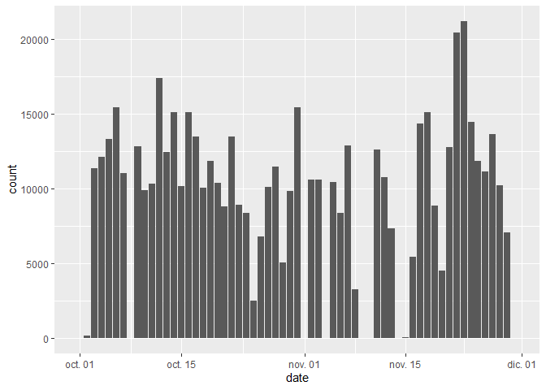
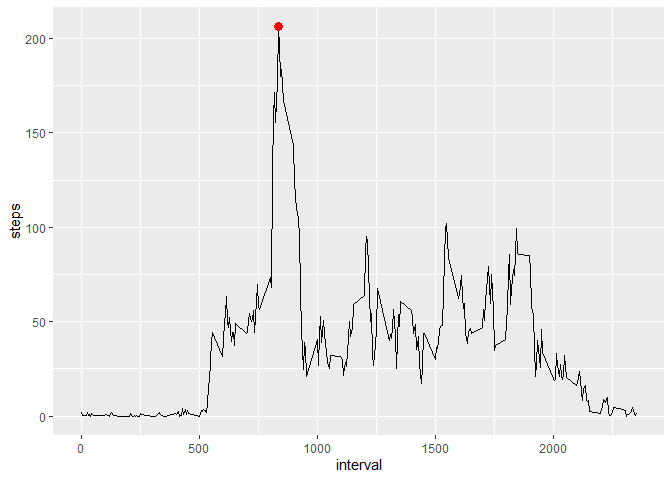
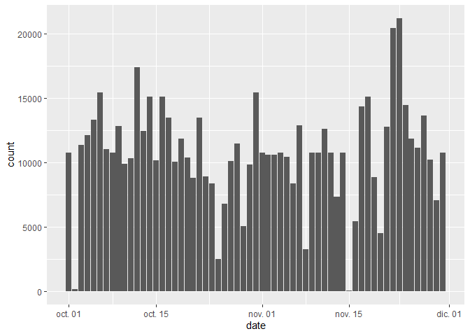
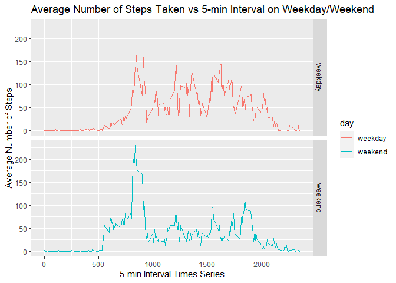

## Loading and preprocessing the data

First, we will load the data and see what we have


```r
unzip("activity.zip")
data<-read.csv("activity.csv")
head(data)
```

```
##   steps       date interval
## 1    NA 2012-10-01        0
## 2    NA 2012-10-01        5
## 3    NA 2012-10-01       10
## 4    NA 2012-10-01       15
## 5    NA 2012-10-01       20
## 6    NA 2012-10-01       25
```

```r
str(data)
```

```
## 'data.frame':	17568 obs. of  3 variables:
##  $ steps   : int  NA NA NA NA NA NA NA NA NA NA ...
##  $ date    : chr  "2012-10-01" "2012-10-01" "2012-10-01" "2012-10-01" ...
##  $ interval: int  0 5 10 15 20 25 30 35 40 45 ...
```

```r
summary(data)
```

```
##      steps            date              interval     
##  Min.   :  0.00   Length:17568       Min.   :   0.0  
##  1st Qu.:  0.00   Class :character   1st Qu.: 588.8  
##  Median :  0.00   Mode  :character   Median :1177.5  
##  Mean   : 37.38                      Mean   :1177.5  
##  3rd Qu.: 12.00                      3rd Qu.:1766.2  
##  Max.   :806.00                      Max.   :2355.0  
##  NA's   :2304
```

Now we have to transform the date variable


```r
library(lubridate)
```

```
## 
## Attaching package: 'lubridate'
```

```
## The following objects are masked from 'package:base':
## 
##     date, intersect, setdiff, union
```

```r
data$date<-ymd(data$date)
str(data$date)
```

```
##  Date[1:17568], format: "2012-10-01" "2012-10-01" "2012-10-01" "2012-10-01" "2012-10-01" ...
```

## What is mean total number of steps taken per day?

We will use data.table and ggplot2 packages to manipulate the data and visualize the histogram


```r
library(data.table)
```

```
## 
## Attaching package: 'data.table'
```

```
## The following objects are masked from 'package:lubridate':
## 
##     hour, isoweek, mday, minute, month, quarter, second, wday, week,
##     yday, year
```

```r
library(ggplot2)
data <- data.table(data)
steps_by_day <- data[,.(steps = sum(steps, na.rm = TRUE)), by = .(date)]
print(ggplot(steps_by_day, aes(x = date, weight = steps)) + geom_bar())
```

<!-- -->

```r
print(paste0('Mean is: ', mean(steps_by_day[,steps], na.rm = T)))
```

```
## [1] "Mean is: 9354.22950819672"
```

```r
print(paste0('Median is: ', median(steps_by_day[,steps])))
```

```
## [1] "Median is: 10395"
```

## What is the average daily activity pattern?

In thIs step we see the daily activity pattern. In red we mark the maximum number of steps


```r
steps_by_5min_interval <- data[,.(steps = mean(steps, na.rm = TRUE)), by = .(interval)]
max_steps <- steps_by_5min_interval[steps == max(steps),]
print(ggplot(steps_by_5min_interval, aes(x = interval, y = steps)) + geom_line() + 
        geom_point(data = max_steps, aes(x = interval, y = steps), col = 'red', size = 3))
```

<!-- -->

```r
print(paste0('Maximum Steps occurs in interval ', max_steps$interval))
```

```
## [1] "Maximum Steps occurs in interval 835"
```


## Imputing missing values

We will impute missing values with the mean


```r
print(paste0('Total number of rows with NAs is ',
             sum(rowSums(is.na(data)) != 0)))
```

```
## [1] "Total number of rows with NAs is 2304"
```

```r
library(dplyr)
data_na_filled <- group_by(data, interval) %>%
  mutate(steps = ifelse(is.na(steps), mean(steps, na.rm = TRUE), steps))
data_na_filled <- data.table(data_na_filled)
steps_by_day <- data_na_filled[,.(steps = sum(steps, na.rm = TRUE)), by = .(date)]
print(ggplot(steps_by_day, aes(x = date, weight = steps)) + geom_bar())
```

<!-- -->

```r
print(paste0('Mean is: ', mean(steps_by_day[,steps])))
```

```
## [1] "Mean is: 10766.1886792453"
```

```r
print(paste0('Median is: ', median(steps_by_day[,steps])))
```

```
## [1] "Median is: 10766.1886792453"
```


## Are there differences in activity patterns between weekdays and weekends?
Making the separation between weekdays and weekend

```r
data_na_filled$day <- ifelse(weekdays(data_na_filled$date) %in% c("sábado","domingo"), "weekday", "weekend")
```
# Plotting

```r
data_na_filled$day <- ifelse(weekdays(data_na_filled$date) %in% c("sábado","domingo"), "weekday", "weekend")


impute.df <- data_na_filled %>% group_by(interval,day) %>% summarise(mean.step=mean(steps))
```

```
## `summarise()` has grouped output by 'interval'. You can override using the `.groups` argument.
```

```r
plot.weekday.interval <- ggplot(impute.df, aes(x=interval, y=mean.step, color=day)) + 
  facet_grid(day~.) +
  geom_line() + 
  labs(title="Average Number of Steps Taken vs 5-min Interval on Weekday/Weekend", y="Average Number of Steps", x="5-min Interval Times Series")
plot.weekday.interval
```

<!-- -->
